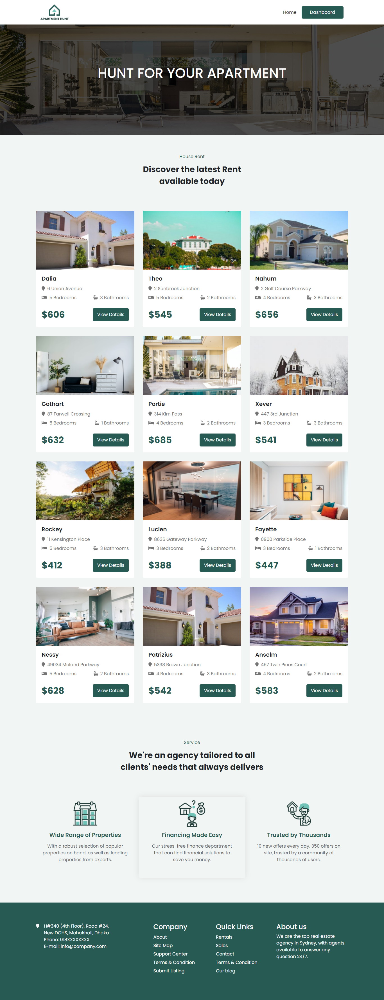
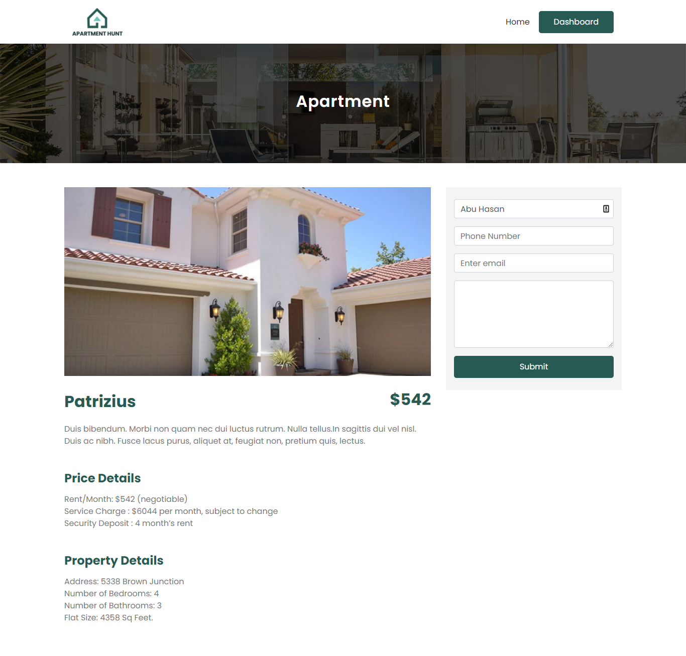
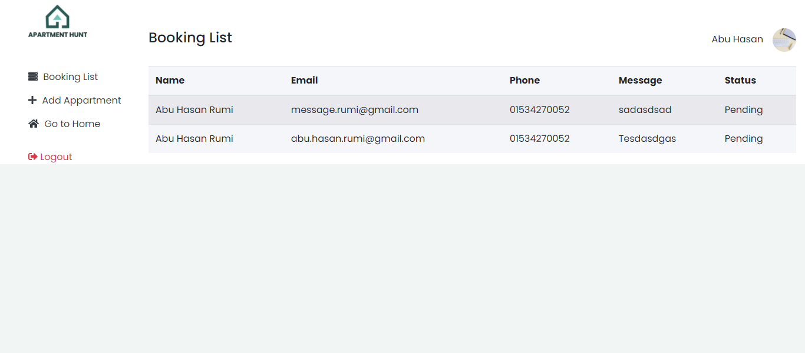
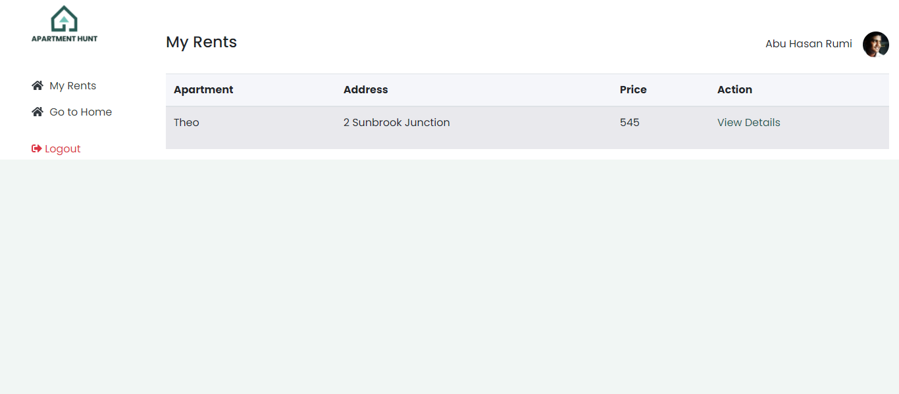

# Appartment Hunt - An apartment booking SPA

Apartment Hunt is a MERN stack house rental service provider single page application with responsive user interface.

## Features
This is a fullstack service selling single page web application with responsive UI. It’s developed by using React, MongoDB, Firebase, JS, ES6, React, React-Router, Html, CSS and reactBootstrap.

#### Client 
- User can book apartment for rent which he/she loves. 
- User will be able to see his/her rent booking status through the status in dashboard

#### Admin
- Admin can add apartment services and manage booking.
- Admin will be able to manage the status of users booking.
- Admin will be able to see all of the pending or confirm booking status.
- Separate dashboard for user and admin

### [`LIVE`](https://apartment-hunt2.netlify.app/)
### [`Backend Repository`](https://github.com/readwanmd/Appartment-Hunt-Server)

 

 

 

 

